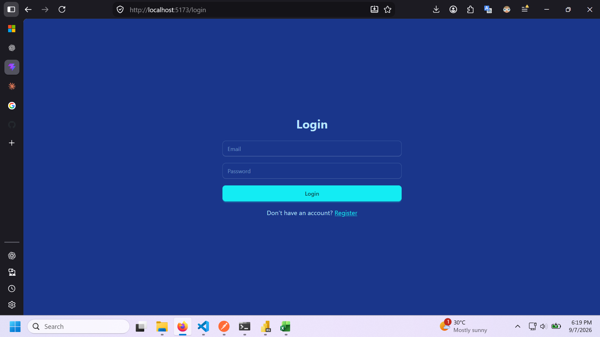
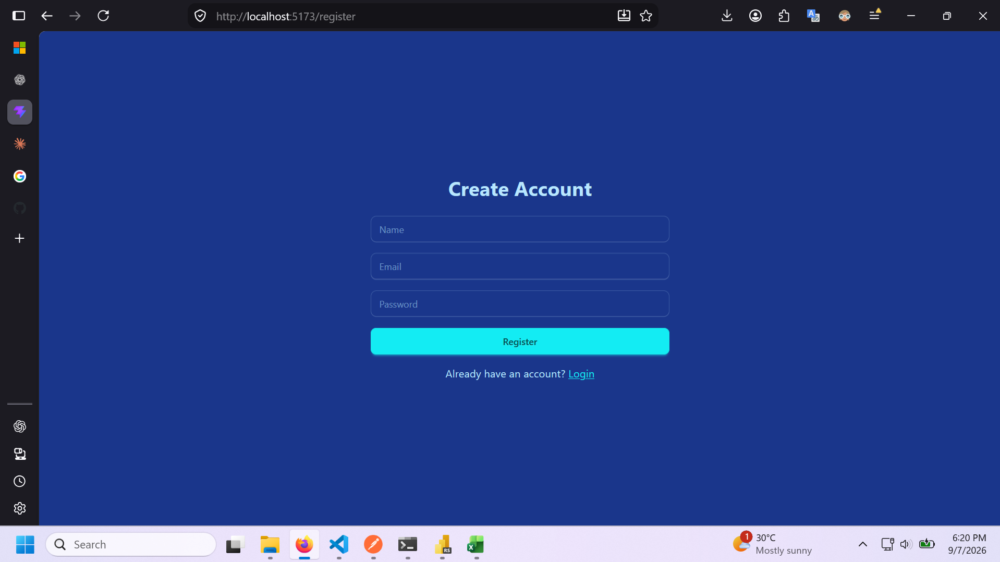
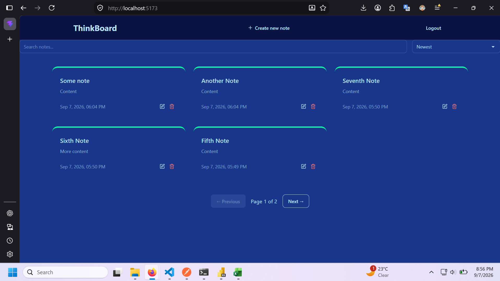
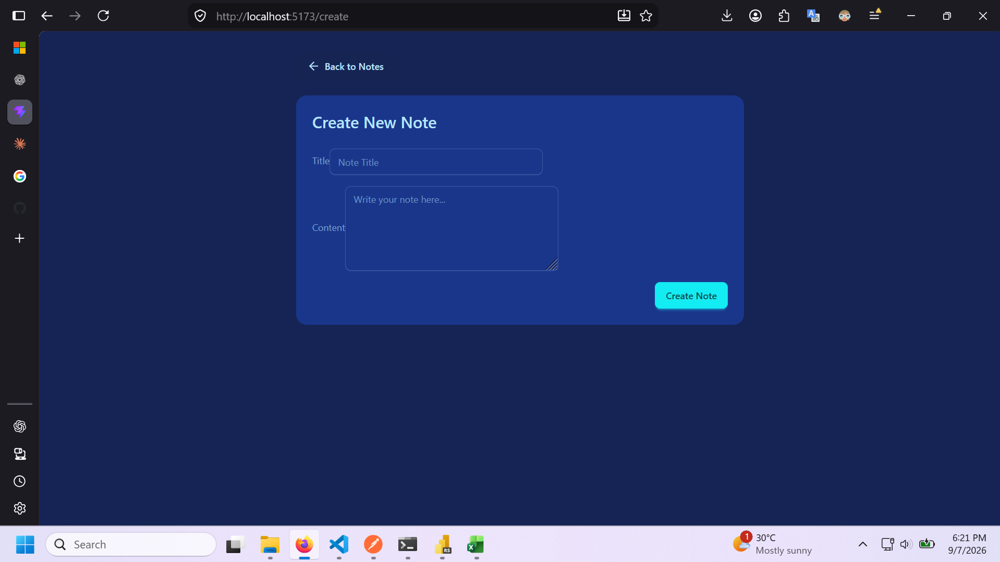
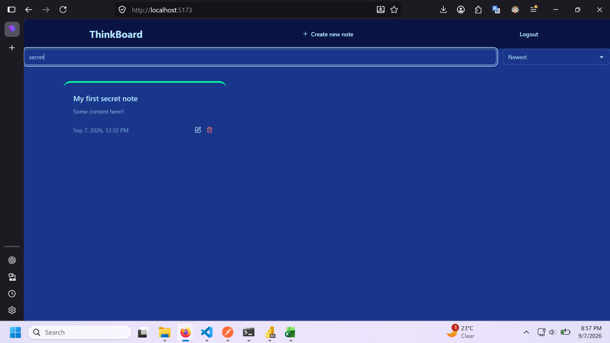
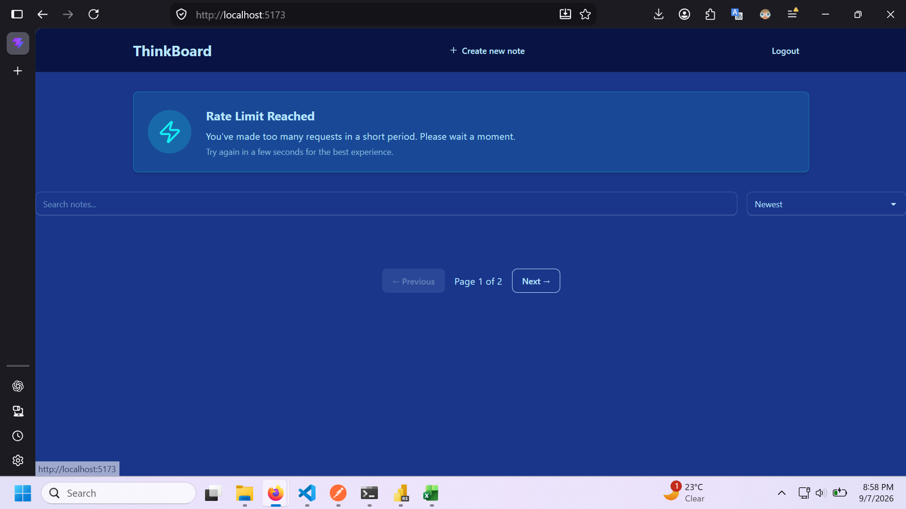

# ThinkBoard

I built a full-stack note management application with the **MERN stack**. It allows users to securely create, manage, search, and organize their personal notes through a responsive web interface.

The application demonstrates the implementation of a complete full-stack workflow, including **user authentication, authorization, RESTful APIs, database management, protected routes, search, sorting, and pagination**.

## Features

### 🔐 User Authentication & Authorization

- User registration and login
- Password hashing with **bcrypt**
- JWT-based authentication
- Protected frontend and backend routes
- User-specific data access
- Users can only access and modify their own notes
- Secure logout functionality

### Edit Note

### 📝 Note Management

- Create new notes
- View existing notes
- Edit notes
- Delete notes
- Automatic creation and update timestamps
- Input validation for note data

### Home Page

### Create Note

### 🔎 Search & Sorting

- Search notes by title or content
- Case-insensitive search
- Sort notes by:
  - Newest
  - Oldest
  - Title A–Z

- Search and sorting work together with pagination

### 📄 Pagination

- Paginated note results
- Configurable number of notes per page
- Previous/Next navigation
- Displays the current page and total pages
- Pagination automatically updates when searching or sorting

### 🛡️ Backend Security

- JWT authentication middleware
- User ownership validation
- Protected REST API endpoints
- Password hashing
- API rate limiting
- Environment variables for sensitive configuration

### ⚡ Frontend

- Responsive React interface
- React Router navigation
- Axios API communication
- Protected routes
- Toast notifications
- Loading and error states
- Responsive UI built with Tailwind CSS and DaisyUI

## Tech Stack

**Frontend**

- React
- React Router
- Axios
- Tailwind CSS
- DaisyUI
- Lucide React
- React Hot Toast

**Backend**

- Node.js
- Express.js
- MongoDB
- Mongoose
- JWT
- bcrypt
- Upstash Rate Limiting

## Architecture

The application follows a client-server architecture:

**React Frontend → REST API → Express Backend → MongoDB**

The frontend communicates with the backend through RESTful API endpoints. Authentication is handled using JWT tokens, while the backend verifies the authenticated user before allowing access to protected resources.

## Key Learning Objectives

This project was developed to demonstrate practical experience with:

- Full-stack MERN development
- RESTful API design
- Authentication and authorization
- JWT-based security
- MongoDB data modeling with Mongoose
- CRUD operations
- Middleware development
- Search and filtering
- Server-side pagination
- API rate limiting
- Frontend state management
- Protected client-side routing
- Connecting a React frontend to an Express backend
- Environment-based configuration
